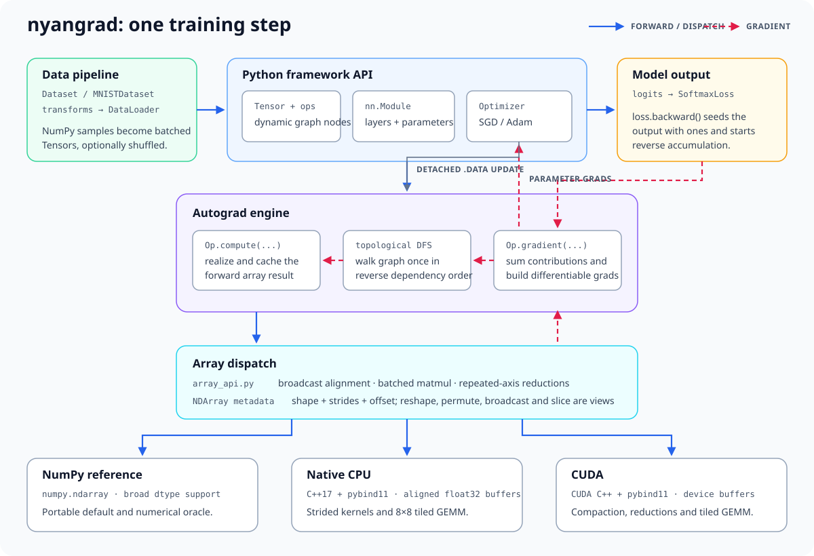
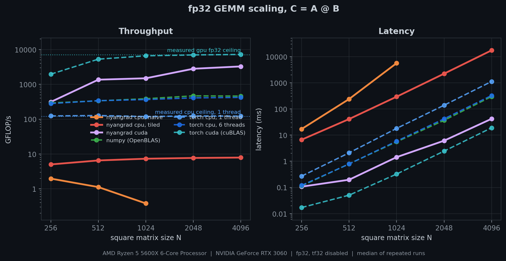
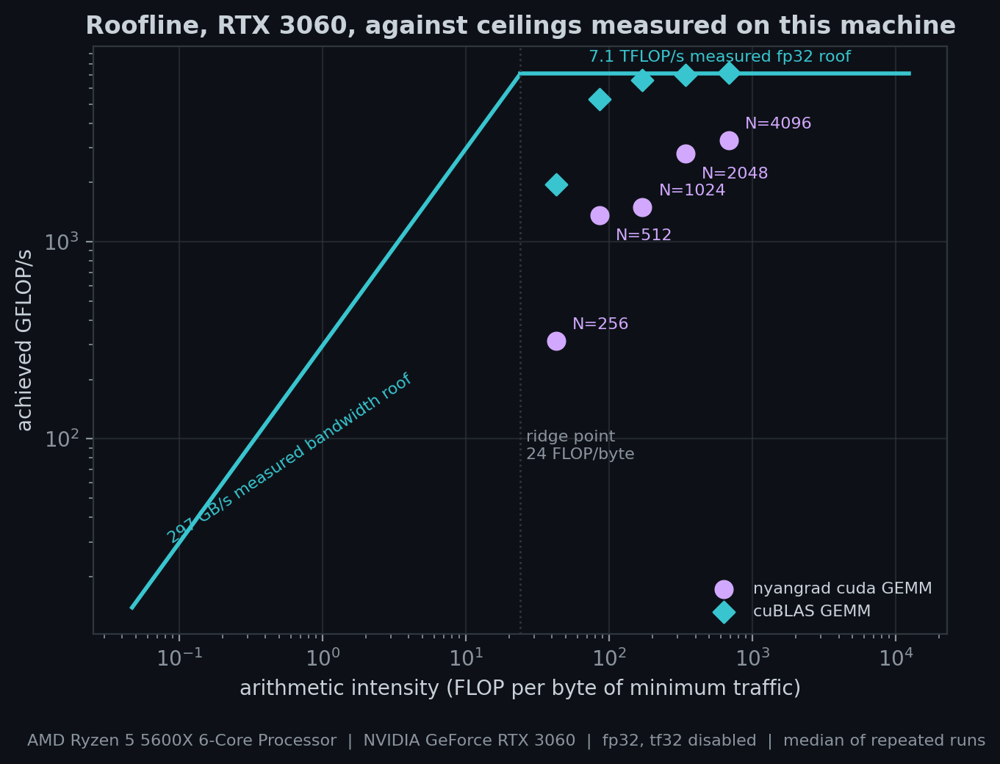
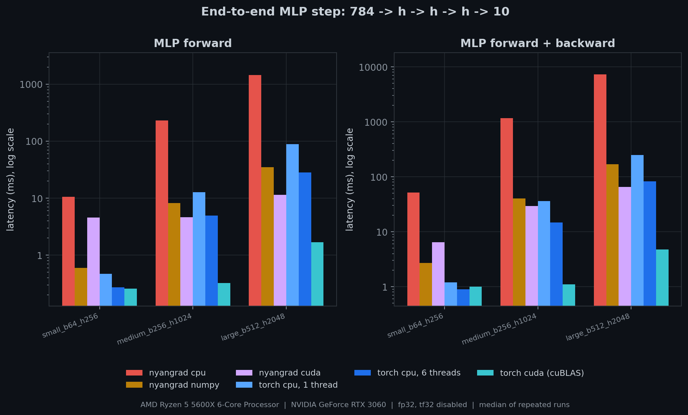
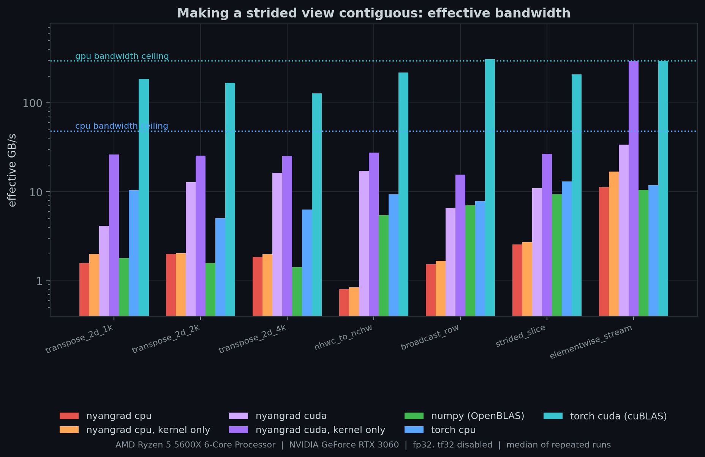
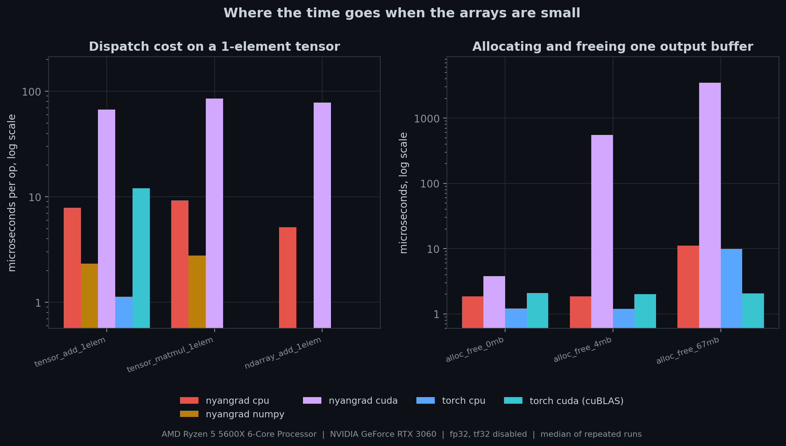

# nyangrad

nyangrad is a PyTorch-style deep learning framework I built from scratch. It started with
[CMU 10-414/714: Deep Learning Systems](https://dlsyscourse.org/) (Graduate level systems course) 
and the basic shape of Needle, then I kept going: the framework now has its own eager autograd
engine, neural network library, strided array runtime, native C++ backend, CUDA
backend, and a benchmark suite for figuring out where all the time actually goes.

This is still a learning framework, and I like that you can read the whole core
without digging through a huge codebase. But it is complete enough to train an
MLP-ResNet on MNIST end to end, including the backward pass and optimizer update,
on NumPy, the C++ backend, or CUDA.



## What is implemented

- Dynamic reverse-mode autodiff over a computation DAG, with cached eager
  execution and gradient accumulation through shared nodes.
- A Tensor API with elementwise arithmetic, matmul, broadcasting, reshape,
  transpose, reductions, ReLU, log/exp, log-softmax and log-sum-exp.
- Modules and training pieces: Linear, Sequential, BatchNorm1d, LayerNorm1d,
  Dropout, Residual, SoftmaxLoss, SGD, Adam, initializers and parameter discovery.
- Dataset/DataLoader abstractions, image transforms, IDX parsing, and an MNIST
  dataset.
- A float32 NDArray with shape, stride and offset metadata. Reshape, permute,
  broadcast and slicing are views; kernels compact only when they need to.
- Three compute paths:
  - NumPy, which is the portable default and correctness reference.
  - Native C++ through pybind11, with aligned storage, strided kernels and an
    8 x 8 tiled CPU matmul.
  - CUDA through pybind11, with device storage, compaction/reduction kernels and
    a handwritten tiled GEMM.
- 285 correctness tests across autograd, layers, optimizers, data loading,
  striding, native CPU and CUDA. Gradient checks use finite differences, and the
  device tests compare full training trajectories.

The split between these pieces is pretty direct. Tensor operations define a
forward compute and a backward rule. The array API makes NumPy-style broadcasting,
batched matmul and multi-axis reductions work across both raw NumPy arrays and the
strided NDArray. NDArray owns only layout metadata and a backend handle; the C++
and CUDA extensions own the actual storage and kernels. Calling `backward()`
topologically sorts the graph, walks it in reverse, sums every incoming gradient,
then builds the input gradients out of ordinary Tensor ops.

## Benchmarks

I wanted the benchmarks to explain the framework, not just give it one flattering
number. The suite covers GEMM scaling, strided compaction and memory bandwidth,
allocation cost, tiny-op dispatch overhead, full MLP forward/backward passes, and
the number of real allocations and kernel launches in one training step.

These are the committed results from an RTX 3060 and Ryzen 5 5600X. PyTorch 2.7
and NumPy/OpenBLAS are the library baselines; TF32 is disabled so the CUDA rows
all do fp32 arithmetic.

| Measurement | nyangrad | Reference | What I take from it |
| --- | ---: | ---: | --- |
| CUDA GEMM, 4096 x 4096 | 3,271 GFLOP/s | cuBLAS 7,219 GFLOP/s | 46% of the measured GPU ceiling, 2.2x behind cuBLAS |
| CUDA streaming kernel, output reused | 298.5 GB/s | measured ceiling 297 GB/s | the simple elementwise kernel reaches the bandwidth roof |
| Large MLP, forward + backward | CUDA 65.0 ms | NumPy 168.6 ms; PyTorch CUDA 4.77 ms | useful acceleration, with a large framework/allocator gap left |
| Tiled CPU GEMM, 4096 x 4096 | 7.9 GFLOP/s | PyTorch 1 thread 122.5 GFLOP/s | the CPU kernel is correct and tiled, but nowhere near a tuned BLAS |
| CUDA add, one element | 67.4 us | PyTorch CUDA 12.0 us | allocation/free and synchronization dominate tiny eager ops |

Every timed backend is checked against a NumPy reference first. The harness warms
up, batches short operations, synchronizes CUDA at sample boundaries, reports the
median plus p10/p90 and IQR, flushes caches where it matters, records clocks and
temperature, and measures the machine ceilings instead of copying theoretical
specs. That last part mattered more than I expected.

<p align="center">
  
  
</p>

<p align="center">
  
  
</p>



The plots are only the summary. [RESULTS.md](benchmarks/RESULTS.md) has all 165
measurements and [CASE_STUDY.md](benchmarks/CASE_STUDY.md) goes through the
methodology, mistakes I found while building it, and what the profiles say to
work on next. The big one is memory management: allocating straight from CUDA
for each op and freeing an output while its kernel is still in flight serializes
work that PyTorch keeps asynchronous with a caching allocator. Kernel fusion and
a better CPU GEMM are the other obvious next steps.

Run a quick smoke benchmark with:

```bash
python3 benchmarks/run_all.py --quick
```

A full run takes several minutes on the benchmark machine:

```bash
python3 benchmarks/run_all.py
python3 benchmarks/report.py
python3 benchmarks/plot_results.py
```

## Install and build

Python 3.10 or newer is required. The NumPy backend works without compiling
anything:

```bash
python3 -m venv .venv
source .venv/bin/activate
python3 -m pip install -e ".[dev]"
```

Build the native backend with CMake through the Makefile:

```bash
make
```

That always builds the C++ extension. If `nvcc` is on `PATH`, CMake also builds
the CUDA extension for the local GPU architecture. The extensions are written
into `nyangrad/`, so an editable install sees them immediately.

The default device is NumPy. A device can be passed to tensors and modules
directly, or selected once:

```python
import numpy as np
import nyangrad as nyan

device = nyan.cuda()
if not device.enabled():
    device = nyan.cpu() if nyan.cpu().enabled() else nyan.numpy_device()
nyan.set_default_device(device)

x = nyan.Tensor(np.random.randn(3, 4).astype("float32"))
w = nyan.Tensor(np.random.randn(4, 2).astype("float32"))

loss = nyan.relu(x @ w).sum()
loss.backward()

print(loss.numpy())
print(x.grad.shape, w.grad.shape)
```

Train the residual MLP on the bundled MNIST files:

```bash
python3 examples/mlp_resnet.py
```

Or choose an accelerated device explicitly:

```python
import nyangrad as nyan
from examples.mlp_resnet import train_mnist

train_mnist(device=nyan.cuda())
```

## Tests

From the repository root:

```bash
pytest
```

The suite checks analytical gradients against numerical ones, exact layer and
optimizer behavior, train/eval state, view aliasing and compaction, CPU/CUDA
agreement, graph lifetime, and small models that actually train down in loss.
The benchmark suite has separate preflight checks before it records performance.

## Repo map

- `nyangrad/autograd.py` - Tensor, graph construction and reverse-mode traversal.
- `nyangrad/ops.py` - differentiable operations and their gradient rules.
- `nyangrad/array_api.py` - common array semantics across NumPy and NDArray.
- `nyangrad/ndarray.py` - strided views, device handles and kernel dispatch.
- `nyangrad/nn.py`, `init.py`, `optim.py`, `data.py` - training library.
- `csrc/` - the C++ and CUDA kernels exposed through pybind11.
- `examples/` - a direct two-layer Tensor example and the MNIST MLP-ResNet.
- `benchmarks/` - harness, suites, raw JSON, generated report and case study.
- `tests/` - framework and backend correctness tests.